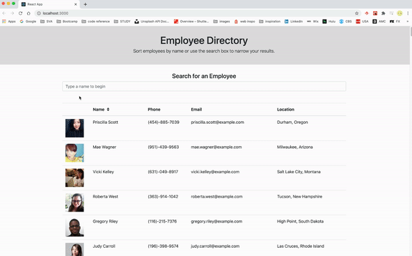

<!-- Badges: MAY NEED TO ADJUST LICENSE BADGE URL -->
  

# Employee Directory Search   
[carolynmary.github.io/employee-search](https://carolynmary.github.io/employee-search/)
 
- - -
- - -
### Searchable employee directory site with capabilities to sort employees by name or filter using the search field.
- - -
- - -

<!-- TOC -->
[How to Use](#how-to-use) // [Credits](#credits) // [License](#license) // [Questions & Feedback](#questions-feedback) 
  
## How to Use 

## Credits
  
<!-- Third Party Asset Creators? Tutorials> // link to web presence -->
[Create React App](https://github.com/facebook/create-react-app) // This project was bootstrapped with React  
[Random User API](https://randomuser.me/) // A free, open-source API for generating random user data.  

## License
    
The code is licensed under the [ISC](https://choosealicense.com/licenses/isc/) License.
  
## Questions & Feedback
  
Have a question or feedback? Send me a note or just say hi, I’d be happy to hear from you!
  
Email: carolyn@carolynmary.com  
  
GitHub: [carolynmary](https://github.com/carolynmary)  
  
Porfolio: [carolynmary.com](https://carolynmary.com) 
  
> “Knowledge is having the right answer. Intelligence is asking the right question.” ~ Unknown
  
 

© 2020 Carolyn Mary Stolze